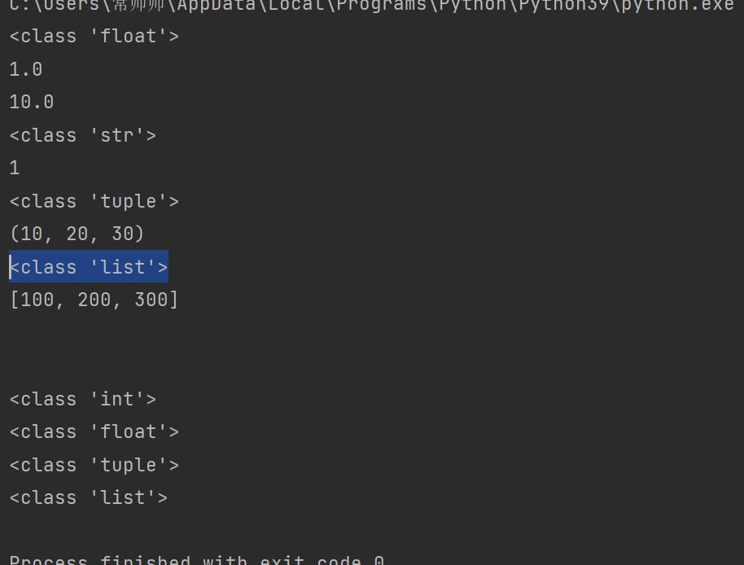
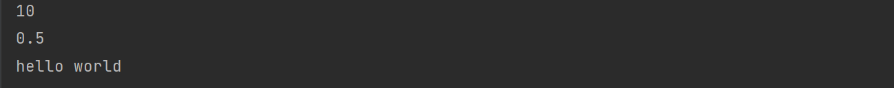
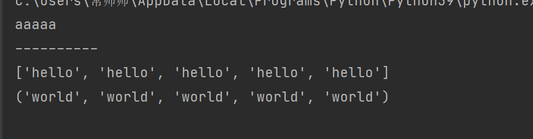

#python 基础

计算机内存： 存储cup要处理的数据

## python入门

### 环境的搭建

​	python解释器的作用： 翻译 python 语言为计算机语言

​	下载：https://www.python.org/downloads/release/python-390/

​	安装： 

​	

​		

PyCharm 是一种 Python IDE（集成开发环境），带有一整套可以帮助用户在使用Python语言开发时提高效率的工具，内部集成的功能如下：

	- Project 管理
	- 智能提示
	- 语法高亮
	- 代码跳转
	- 调试代码
	- 解释代码（解释器）
	- 框架和库
	- 。。。。。

安装PyCharm

​	下载：https://www.jetbrains.com/pycharm/download/#section=windows

​	安装：


勾选 64-bit launcher 和  .py


####PyCharm 基本使用


新建文件并书写代码

项目根目录或根目录内部任意位置--右键 -- 【new】-- 【Python File】-- 输入文件名 -- 【OK】

>注意 : 如果是将来要上传到服务器的文件，那么文件名切记不能用中文

运行文件： 右键 run

####PyCharm 的基本设置

【file】-- 【Settings】/【Default Settings】

- Theme： 修改主题
- Name： 修改主题字体
- Size： 修改主题字号

####修改代码文字格式

	- Font: 修改字体
	- Size：修改字号
	- Line Spacing: 修改行间距

####修改解释器

进入Setting -- [Project: 项目名称] -- 【Peoject Interpreter】-- 【设置图表】-- 【add】-- 浏览到目标解释器 -- 【OK】-- 【OK】

####项目管理

打开项目

​	【File】 -- 【Open】 -- 浏览选择目标项目根目录 -- 【OK】-- 选择打开项目方式

打开项目的方式共三种，分别如下：


​	this window 

​		覆盖当前项目，打开新的项目

​	New window

​		在新的 PyCharm  打开项目

​	Attach 

​		在当前窗口打开多个项目

关闭项目

​	【file】-- 【Close Project】/【Close Projects in current window】

### 注释

#### 单行注释

​		快捷键 ctr+/

​		只能注释一行内容，语法如下：

```python
# 注释内容
```

> 代码后边放注释 需要在代码后边敲俩个空格 在 # 空格加注释

####多行注释

```python
"""
	第一行注释
	第二行注释
	第三行注释
"""
'''
	注释1
	注释2
	注释3
'''
```

> 单行注释通常是对一行代码的解释说明
>
> 多行注释通常是对代码块、代码对的解释说明


###  变量

#### 变量的作用

​	程序中，数据都是临时存储在内存中，为了更快速的查找或使用这个数据，通常我们把这个数据在内存中存储之后定义一个名称，这个名称就是变量

>变量就是一个存储数据的时候当前数据所在的内存地址的名字而已

#### 定义变量

`变量名 = 值`

变量名自定义，要满足==表述符==命名规则

#### 标识符

​	标识符命名规则是Python中定义各种名字的时候的统一规范，具体如下：

		- 由数字、字母、下划线组成
		- 不能数字开头
		- 不能使用内置关键字
		- 严格区分大小写

```python
False		None	True	and		as		assert		break		class
continue	def		del		elif	else	except		finally		for
from		global	if		import	in		is			lambda		nonlocal
not			or		pass	raise	return	try			while		with
yield

```

#### 命名习惯

	- 见名知意
	- 大驼峰：既每个单词首字母都大写，例如： Myname
	- 小驼峰：第二个（含）以后的单词首字母大写，例如：myName
	- 下划线： 例如： my_name

#### 使用变量

```python
my_name = 'Tom'
print(my_name)
schoolName = '阿西吧'
print(schoolName)
```

####认识bug


#### Debug工具

​	Debug工具是PyCharm IDE中集成的用来调试程序的工具，在这里程序员可以查看程序的执行细节和流程或者调解bug

Debug工具

	1.  打断点
	2.  Debug调试

打断点

​	断点位置

​		目标要调试的代码块的第一行代码即可，即一个断点即可

​	打断点的方法

​		点击代码行号右边空白的位置

#### 认识数据类型	


```python
# int 整型
num1=1
# float 浮点型，都是小数
num2=1.1
# str 字符串 数据都要带引号
a = 'hello world'
# bool 布尔型，通常判断的时候使用
b = True
# 复杂的数据序列
# list 列表
c = [10, 20, 30]
# tuple 元组
d = (10, 20, 30)
# set 集合
e = {10, 20, 30}
# dict 字典  'name': 'TOM'  这种叫做键值对
f = {'name': 'TOM', 'age': 15}
print(type(num1))
print(type(num2))
print(type(a))
print(type(b))
print(type(c))
print(type(d))
print(type(e))
print(type(f))
```


### 输出

#### 格式化符号

| 格式符号 |          转换          |
| :------: | :--------------------: |
|    %s    |         字符串         |
|    %d    |   有符号的十进制整数   |
|    %f    |         浮点数         |
|    %c    |          字符          |
|    %u    |    无符号十进制整数    |
|    %o    |       八进制整数       |
|    %x    | 十六进制整数（小写ox） |
|    %X    | 十六进制整数（大写OX） |
|    %e    | 科学计数法（小写'e'）  |
|    %E    | 科学计数法（大写'E'）  |
|    %g    |      %f和%e的简写      |
|    %G    |      %f和%E的简写      |

技巧

- %06d 表示输出的整数显示位数，不足以0补全，超出当前位数则原样输出

- %.2f，表示小数点后显示的小数位数

- 格式化字符串除了%s, 还可以写为`f'{表达式}'`

- f-格式化字符串是Python3.6中新增的格式化方法，该方法更简单易读

  ```python
  age = 18
  name = 'Tom'
  weight = 75.5
  stu_id = 1
  stu_id2 = 1000
  print('今年我的年龄是%d岁' % age)
  # 位数不够补零
  print('今年我的学号是%03d岁' % stu_id)
  # 位数多了原位显示
  print('今年我的学号是%03d岁' % stu_id2)
  print('今年我的名字%s，今年%d,明年%d' % (name, age, age+1))
  print('今年我的名字%s，体重%0.2f,明年%d' % (name, weight, age+1))
  # %d %f 等和汉字连到一起最后都用字符串做展示，输出的是字符串例型，在此前提下所以都可用%s代替
  print('今年我的名字%s，今年%s,体重%s' % (name, age, weight))
  # f格式化字符串
  print(f'我的名字是{name},今年{age},明年{age+1}')
  
  ```

  

#### 转义字符

- `\n`：换行 
- `\t` ：制表符，一个tab键（4个空格）的距离

```python
print('hello')
print('woeld')
print('hello world')
print('hello\nworld')
print('\tabcd')


```


#### print结束符	

```python
print('hello', end="\n")
print('world', end="\t")
print('hello', end="...")
print('Python')
```


### 输入

```python
input("输入内容")
```

输入特点

+ 当程序执行到`input`，等待用户输入，输入完成之后才继续向下执行
+ 在Python中，`input`接收用户输入后，一般存储到变量，方便使用
+ 在Python中，`input`会把接收到的任意用户输入的数据都当作字符串处理

### 转换数据类型

input得到字符串类型，若想得到整型就需要转换数据类型

转换数据类型的函数

|          函数          |                         说明                         |
| :--------------------: | :--------------------------------------------------: |
|   ==int(x [ base])==   |                   将x换为一个整数                    |
|     ==float（x）==     |                 将x转换为一个浮点数                  |
| complex(real [ imag ]) |         创建一个复数，real为实部，imag为虚部         |
|       ==str(x)==       |                 将对象x转换为字符串                  |
|        repr(x)         |              将对象x转换为表达式字符串               |
|     ==eval(str)==      | 用来计算在字符串中的有效Python表达式，并返回一个对象 |
|      ==tuple(s)==      |                将序列s转换为一个元组                 |
|     ==list（s）==      |                将序列s转换为一个列表                 |
|         chr(x)         |           将一个整数转换为一个Unicode字符            |
|         ord(x)         |           将一个字符转换为它的ASCll整数值            |
|         hex(x)         |          将一个整数转换为一个十六进制字符串          |
|        otc（x）        |           将一个整数转换为一个八进制字符串           |
|         bin(x)         |           将一个整数转换为一个二进制字符串           |

```python
# 将数据转换为浮点型
num1 = 1
str1 = '10'
print(type(float(num1)))
print(float(num1))
print(float(str1))
# 将数据转换为字符串类型
print(type(str(num1)))
print(str(num1))
# 将一个序列转换为元组
list1 = [10, 20, 30]
print(type(tuple(list1)))
print(tuple(list1))
# 将一个序列转换为列表
t1 = (100, 200, 300)
print(type(list(t1)))
print(list(t1))
# 计算在字符串中的有效Python表达式，并返回一个对象 所人话就是根据字符串应该对应的类型转为这种类型
str2 = '1'   # 转整型
str3 = '1.1'  # 转浮点型
str4 = '(1000, 2000, 3000)'  # 转元组
str5 = '[1000, 2000, 3000]'  # 转列表
print('\n')
print(type(eval(str2)))
print(type(eval(str3)))
print(type(eval(str4)))
print(type(eval(str5)))
```





### PyCharm 交互式开发


​	可以实现的效果就是，可以直接书写代码，不用 print 也可直接输出，可快速的展示结果给程序员

​	可以交互式测试，但是不保存代码

### 运算符

#### 运算符的分类

+ 算数运算符
+ 赋值运算符
+ 复合赋值运算符
+ 比较运算符
+ 逻辑运算符

#### 算数运算符

| 运算符 |  描述  |                        实例                        |
| :----: | :----: | :------------------------------------------------: |
|   +    |   加   |                  1+1 输出结果为 2                  |
|   -    |   减   |                  1-1 输出结果为 0                  |
|   *    |   乘   |                 2 * 2 输出结果为 4                 |
|   /    |   除   |                 10/2 输出结果为 5                  |
|   //   |  整除  |                9 // 4 输出结果为 2                 |
|   %    |  取余  |                 9 %4 输出结果为 1                  |
|   **   |  指数  |                2 ** 4 输出结果为 16                |
|   ()   | 小括号 | 小括号用来提高运算优先级，既（1+2）*3 输出结果为 9 |

> 混合运算优先级顺序：（）高于 ** 高于 * / // % 高于 + -

#### 赋值运算符

| 运算符 | 描述 |                实例                 |
| :----: | :--: | :---------------------------------: |
|   =    | 赋值 | 将`=`右侧的结果赋值给等号左侧的变量 |

+ 单个变量赋值

```python
num = 1
print(num)
```

+ 多个变量赋值

```python
num1,float1,str1 = 10, 0.5, 'hello world'
print(num1)
print(float1)
print(str1)
```



+ 多变量赋相同的值

```python
a = b = 10
```

#### 复合赋值运算符

| 运算符 |      描述      |                实例                 |
| :----: | :------------: | :---------------------------------: |
|   +=   | 加法赋值运算符 |        c +=a 等价于 c = c+a         |
|   -=   | 减法赋值运算符 |       c -= a 等价于 c = c - a       |
|   *=   | 乘法赋值运算符 |     c *= a 等价于 c = c  *   a      |
|   /=   | 除法赋值运算符 |        c /= a 等价于 c = c/a        |
|  //=   | 整除赋值运算符 |      c // =  a 等价于 c = c//a      |
|   %=   | 取余赋值运算符 |       c %= a 等价于 c =c  %a        |
|  **=   |  幂赋值运算符  | c ** = a 等价于    c = c   **     a |

>`d *= 1+2` 先算复合赋值运算符右面的表达式，再算复合赋值运算符

#### 比较运算符

比较运算符也叫关系运算符，通常用来判断


#### 逻辑运算符

| 运算符 | 逻辑表达式 | 描述                                                         | 实例                                     |
| ------ | ---------- | ------------------------------------------------------------ | ---------------------------------------- |
| and    | x and y    | 布尔“与”：如果 x 为False , x and y 返回 False， 否则返回y 的值 | True and False 返回False                 |
| or     | x or y     | 布尔“或”：如果 x 为True, 返回 True， 否则返回y 的值          | False or True 返回 True                  |
| not    | not x      | 布尔“非”：如果 x 为True,  返回 False， 如果 x 为False,  返回 True | not True 返回 False ，not False返回 True |

> and 运算符，只要有一个值为0，则结果为0，否则结果为最后一个非0数字
>
> or 运算符，只有所有值为0结果才为0，否则结果为第一个非0数字

## 流程控制

### 条件语句

#### if 语法

```python
if 条件：
	条件成立执行代码1
	条件成立执行代码2
	条件成立执行代码3
    。。。
elif 条件2：
	条件2成立执行代码1
else:
    条件bu成立执行代码1
	条件不成立执行代码2
    
if True：
	print('条件成立执行代码1')
    print('条件成立执行代码2')
else：
	print('条件bu成立执行代码1')
```

#### 三目运算符

```python
条件成立执行的表达式 if 条件 else 条件不成立执行的表达式

a = 1
b = 2
c = a if a>b else b
print(c)
```


### 循环

```python
while 条件：
	条件成立重复执行的代码1
    ....
```

#### break 和continue

break 是终止此循环

continue 退出当前一次循环继而执行下一次循环代码

```python
i = 0
while i <= 5:
    if i == 4:
        print(f'吃饱了不吃了')
    	break
    print(f'吃了第{i}个苹果')
    i += 1
    
i = 0
while i <= 5:
    if i == 4:
        print(f'吃出一个大虫子，这个苹果不吃了')
        # 这里必须对 i 进行操作，否则 continue 跳出 一直等于 3 会陷入死循环
        i += 1
    	continue
    print(f'吃了第{i}个苹果')
    i += 1

```

#### for 循环

```python
for 临时变量 in 序列:
    重复执行的代码
    。。。
```

#### while ... else 

```python
while 条件:
    条件成立重复执行的代码
else:
    循环正常结束之后要执行的代码，break跳出则不执行这里，但是continue就会执行
```

#### for...else

​	与while...else 类似


## 数据序列

### 字符串

#### 一对引号字符串

```python
name1 = 'Tom'
name2 = "Rose"
```

#### 三引号字符串

```python
name3 = '''Tom'''
a = '''i am Tom
		nice to meet you'''
b =  """i am tom
		nice to meet you""" # 代码换行，但是输出的效果也换行 三引号形式的字符串支持换行
c = 'i an tom ' \
	'nice to meet you' # 代码换行，但是输出的效果和不换行一样
d = "I'm Tom"
f = 'I\'m Tom'
```

#### 下标

下标又叫索引，就是编号，可以用来精确的找到每个字符. 字符串	列表	元组都支持

``` python
name = 'abcd'
print(name[0]) # a
print(name[1]) # b
```

####  切片

切片是指对操作的对象截取其中一部分的操作。字符串	列表	元组都支持切片操作

```python
序列[开始下标:结束位置下标:步长]
```

> 1. 不包含结束位置下标对应的数据，正负整数均可
> 2. 步长是选取间隔，正负整数均可，默认步长为1

```python
str = '012345678'
print(str[2:5:1]) # 234
print(str[2:5:2]) # 24
print(str[2:5]) # 234
print(str[:5]) # 01234 -- 如果不写开始，默认从0开始选取
print(str[2:]) # 2345678 -- 如果不写结束，表示选取到最后
print(str[:]) # 012345678 -- 如果不写开始和结束，表示选取所有
print(str[::-1]) # 876543210 -- 如果步长为负数，表示倒叙选取
print(str[2:5:-1]) # 选不出来 原因和下边选不出来的原因一致
print(str[5:2:-1]) # 543
print(str[-4:-1]) # 567 -- 下标-1表示最后一个数据，依次向前类推
print(str[-4:-1:1]) #567
print(str[-4:-1:-1]) # 不能选取出数据：从-4开始到-1结束，选取方向为从左到右，但是-1步长从右向左
# *** 如果选取方向（下标开始到结束的方向）和 步长的方向冲突，则无法选取数据
print(str[-1:-4:-1]) # 876
```


####  查找

所谓字符串查找方法既是查找子串在字符串中的位置或出现的次数

find()：检测某个子串是否包含在这个字符串中，如果在返回这个子串开始的位置下标，否则则返回-1

语法

```python
字符串序列.find(子串，开始位置下标，结束位置下标)
```

>开始和结束位置的下标可以省略，表示在整个字符串序列中查找

index(): 检测某个子串是否包含在这个字符串中，如果在返回这个子串开始的位置下标，否则则报异常

语法

```python
字符串序列.index(子串,开始位置下标，结束位置下标)
```

>  开始和结束位置的下标可以省略，表示在整个字符串序列中查找

rfind(): 和 find() 功能相同，但查找方向为右侧开始

rindex(): 和 index() 功能相同，但查找方向为右侧开始

count(): 返回某个子串在字符串中出现的次数

语法

```python
字符串序列.count(子串,开始位置下标，结束位置下标)
```

> 开始和结束位置的下标可以省略，表示在整个字符串序列中查找

```python
mystr = "hello world and itcast and itheima and Python"
# 1. find()
print(mystr.find('and'))  # 12
print(mystr.find('and', 15, 30))  # 23
print(mystr.find('ands'))  # -1 ,ands子串不存在

# 2.index()
print(mystr.index('and'))  # 12
print(mystr.index('and', 15, 30))  # 30
# print(mystr.index('ands'))  # 报错

# 3.count()
print(mystr.count('end', 15, 30))  # 1
print(mystr.count('end', 15, 30))  # 3
print(mystr.count('ends',))  # 0

print(mystr.rfind('end'))  # 35
print(mystr.rfind('ends'))  # -1

print(mystr.index('and'))  # 35
print(mystr.index('ands'))  # 报错

```


#### 修改字符串

所谓的修改字符串，指的就是通过函数的形式修改字符串中的数据

replace(): 替换

语法

```python
字符串序列.replace(旧子串， 新子串，替换次数)
```

> 注意： 替换次数如果超出子串出现次数，则替换次数为该子串出现次数

split(): 按照指定字符分割字符串

语法

```python
字符串序列。split(分割字符， num)
```

> 注意： nmu表示的是分割字符出现的次数，即将来返回数据个数为num+1个

join(): 用一个字符或子串合并字符串，既是将多个字符串合并为一个新的字符串

语法

```python
字符或子串.join(多字符串组成的序列)
```

```python
mystr = "hello world and itcast and itheima and Python"

# replace() 把and换成he
# new_str = mystr.replace('and', 'he')
# new_str = mystr.replace('and', 'he'， 1)  # 替换一次
# new_str = mystr.replace('and', 'he'， 10)  # 替换次数超出表示替换所有
# print(mystr)
# print(new_str)
# ***调用了replace函数后，发现原有字符串的数据并没有做到修改，修改后的值是replace函数的返回值
# *** 说明字符串是不可变数据类型
# 数据是否可以改变划分为俩大类，可变类型，不可变类型

# spilt() -- 分割，返回一个列表 丢失分割字符
# list1 = mystr.split('and')
# list1 = mystr.split('and', 3)  # 一共返回三个数据
# print(list1)

# join() -- 合并列表里面的字符串数据为一个大字符串
mylist = ['aa', 'bb', 'cc']
# aa...bb...cc
new_str = '...'.join(mylist)
print(new_str)

```


capitalize(): 将字符串第一个字符转换成大写

> 注意： capitalize() 函数转换后，只字符串第一个字符大写，其他的字符全部小写

title():  将字符串每个单词首字母转换成大写

lower(): 将字符串中大写转小写

upper(): 将字符串中小写转大写

```python
mystr = "hello world and itcast and itheima and Python"
# 结果： Hello world and itcast and itheima and Python
print(mystr.capitalize())
# 结果： Hello World and Itcast And Itheima And Python
print(mystr.title())
# 结果： hello world and itcast and itheima and Python
print(mystr.lower())
# 结果： HELLOW WORLD AND ITCAST AND ITHEIMA AND PYTHON
print(mystr.upper())
```

Istrip():   删除字符串左侧空白字符

rstrip(): 删除字符串右侧空白字符

strip(): 删除字符串俩侧空白字符

```python
mystr = "  hello world and itcast and itheima and Python  "
print(mystr)
new_str1 = mystr.lstrip()
print(new_str1)
new_str2 = mystr.rstrip()
print(new_str2)
new_str3 = mystr.strip()
print(new_str3)
```


ljust(): 返回一个原字符串左对齐，并使用指定字符（默认空格）填充至对应长度的新字符串

```python
字符串序列.ljust(长度，填充字符)
# 这里的长度就是对齐方式的范围
```

rjust(): 返回一个原字符串右对齐，并使用指定字符（默认空格）填充至对应长度的新字符串，语法和ljust() 相同

center(): 返回一个原字符串居中对齐，并使用指定字符（默认空格）填充至对应长度的新字符串，语法与ljust() 相同

#### 判断

startswith(): 检查字符串是否是以指定子串开头，是则返回True ，否则返回 False。如果设置开始和结束位置下标，则在指定范围内检查。

语法

```python
字符串序列.startswith(子串， 开始位置下标， 结束位置下标)
```

endswith(): 判断字符串是否以某个子串结尾，是则返回True ，否则返回 False。如果设置开始和结束位置下标，则在指定范围内检查。

语法，与startswith() 类似

isalpha(): 如果字符串至少有一个字符并且所有字符都是字母则返回True，否则返回False

isdigit():  如果字符串只包含数字则返回True否则返回False

```python
mystr = "hello world and itcast and itheima and Python"

# startswith(): 判断字符串是否以某个子串开头
print(mystr.startswith('hello'))  # True
print(mystr.startswith('hel'))  # True
print(mystr.startswith('hels'))  # False

# endswitch(): 判断字符串是否以某个子串结尾
print(mystr.endswith('Python'))  # True
print(mystr.endswith('Pythons'))  # False

# isalpha(): 判断非空字符串都是由字母组成
print(mystr.isalpha())  # 有空格返回false

# isdidit(): 判断非空字符串都是由字母组成
print(mystr.isdigit())  # False
mystr1 = '123'
print(mystr1.isdigit())  # True

# isalnum(): 判断非空字符串都是由数字或字母组成
print(mystr.isalnum())  # False
print(mystr1.isalnum())  # True
mystr2 = '123aaa'
print(mystr2.isalnum())  # True

# isspace(): 判断非空字符串都是由数字或字母组成
mystr3 = '    '
print(mystr.isspace())  # False
print(mystr3.isspace())  # True

```


### 列表

列表可以一次存储多个数据，且各个数据可以不同类型，但是尽量存储相同类型，为了后期好控制

#### 列表格式

```python
[数据1、数据2、数据3、数据4....]
```

#### 列表的常用操作

##### 查找

根据下标查找

```python
name_list = ['Tom', 'Lily', 'Rose']
print(name_list)  # ['Tom', 'Lily', 'Rose']
print(name_list[0])  # Tom
print(name_list[1])  # Lily
print(name_list[3])  # Rose
```

查找函数

index():  返回指定数据所在位置的下标

语法

```python
列表序列.index(数据， 开始位置下标， 结束位置下标)
```

count(): 统计指定数据在当前列表中出现的次数

len(): 访问列表长度即列表中数据的个数

```python
name_list = ['Tom', 'Lily', 'Rose']

# index()
print(name_list.index('Tom'))  # 0
# print(name_list.index('Toms'))  # 不存在报错

# count
print(name_list.count('Tom'))  # 1
print(name_list.count('Toms'))  # 0

# len
print(len(name_list))  # 3

```

判断是否存在

in: 判断指定数据在某个列表序列，如果在返回True，否则返回False

not in：判断指定数据不在某个列表序列，如果不在返回True， 否则返回False

```python
name_list = ['Tom', 'Lily', 'Rose']

# in
print('Tom' in name_list)  # True
print('Toms' in name_list)  # False

# not in
print('Tom' not in name_list)  # False
print('Toms' not in name_list)  # True


```

##### 增加

增加指定数据到列表中

append(): 列表结尾追加数据

语法

```python
列表序列.append( 数据 )
```

```python
name_list = ['Tom', 'Lily', 'Rose']

name_list.append('xiaoming')
print(name_list)  # 列表数据可改，是可变数据类型
name_list.append([11,22])
print(name_list)  # 追加数据时候如果是个列表序列，则追加整个序列到列表
```


extend(): 列表结尾追加数据，如果数据是一个序列，则将这个序列的数据逐一添加到列表

```python
name_list = ['Tom', 'Lily', 'Rose']

name_list.extend('xiaoming')  # 将字符串拆开添加
print(name_list)
name_list.extend(['xiaoming', 'xiaohong'])  # 将列表拆开添加
print(name_list)

```


insert(): 指定位置新增数据

语法

```python
列表序列.insert(位置下标， 数据)
```

```python
name_list = ['Tom', 'Lily', 'Rose']

name_list.insert(1, 'xiaoming')
print(name_list)

```


##### 删除

del

语法

```python
del 目标  # 或者 del(目标)
```

pop(): 删除指定下标的数据（默认为最后一个），并返回该数据

语法

```python
列表序列。pop(下标)
```

remove(): 移除列表中某个数据的第一个匹配项

语法

```python
列表序列。remove(数据)
```

clear()： 清空列表

```python
name_list = ['Tom', 'Lily', 'Rose']

# del name_list
# del(name_list)
# print(name_list)  # name 'name_list' is not defined
# del 可以删除指定下标的数据
# del name_list[0]
# print(name_list)   # ['Lily', 'Rose']

# pop() 删除指定下标的数据，如果不指定下标，默认删除最后一个数据，无论按照下标或最后一个数据删除，
# pop() 都会返回这个被删除的数据
# del_name = name_list.pop(1)
# print(del_name)  # Lily
# print(name_list)  # ['Tom', 'Rose']

# remove
# name_list.remove('Rose')
# print(name_list)  # ['Tom', 'Lily']

# clear
name_list.clear()
print(name_list)  # []

```

##### 修改

* 修改指定下标数据

* 逆置排序： reverse()

* 排序： sort()

  语法

  ```python
  列表序列.sort(key = None, reverse=False)
  ```

  > reversr表示排序规则，reverse = True 降序， reverse = False 升序（默认）

##### 复制

copy():

```python
name_list = ['Tom', 'Lily', 'Rose']

list1 = name_list.copy()
print(list1)
print(name_list)

```


#### 列表遍历

```python
name_list = ['Tom', 'Lily', 'Rose']

i = 0
while i < len(name_list):
    print(name_list[i])
    i += 1

for j in name_list:
    print(j)

```


#### 列表嵌套

所谓列表嵌套指的就是一个列表里面包含了其他的子列表

```python
name_list = [['Tom', 'Lily', 'Rose'],
             ['小明', '小红', '小绿'],
             ['zhngsan', 'lisi', 'wangwu']]
print(name_list[0])  # ['Tom', 'Lily', 'Rose']
print(name_list[0][1])  # Lily
```


### 元组

一个元组可以存储多个数据，元组内的数据是不能修改的

#### 定义元组

元组特点： 定义元组使用小括号，且逗号隔开各个数据，数据可以是不同的数据类型

```python
# 多个数据元组
t1 = (10, 20, 30)
print(type(t1))
# 单个数据的元组
t2 = (10,)
print(t2)
# 如果单个数据的元组不加逗号
t3 = (10)
print(t3)

```


> 注意： 如果定义的元组只有一个数据，那么这个数据后面也要添加逗号，否则数据类型为唯一的这个数据的数据类型

#### 元组的常见操作

 元组不支持修改，删除，只支持查找，具体如下：

* 按下标查找数据

* index(): 查找某个数据，如果数据存在返回对应的下标。否则报错，语法和列表、字符串的index方法相同

* count(): 统计某个数据在当前元组出现的次数

* len(): 统计元组中数据的个数 

  ```python
  tuple1 = ('aa', 'bb', 'cc', 'bb')
  
  # 下标
  print(tuple1[0])
  
  # index()
  print(tuple1.index('bb'))
  # print(tuple1.index('bbb'))  # 报错
  
  # count()
  print(tuple1.count('aa'))
  print(tuple1.count('aaa'))
  
  # len
  print(len(tuple1))
  
  ```

  

  > 注意： 元组内的直接数据如果修改则立即报错
  >
  > 但是如果元组里面有列表，修改列表里面的数据则支持的，但谨慎修改

  ```python
  t1 = ('aa', 'bb', ['cc', 'dd'])
  t1[2][0] = 'Tom'
  print(t1)
  
  ```

  

### 字典

字典里面的数据是以键值对形式出现，字典数据和数据顺序没有关系，即字典不支持下标，后期无论数据如何变化，只需要按照对应的键的名字查找数据即可

#### 创建字典

字典的特点：

* 符号为大括号

* 数据为键值对形式出现

* 各个键值对之间用逗号隔开


```python
# 有数据的字典： name的值Tom，age的值是20，gender的值是男
dict1 = {'name': 'Tom', 'age': 20, 'gender': '男'}
print(dict1)
print(type(dict1))

# 创建空字典
dict2 = {}
print(type(dict2))

dict3 = dict()
print(type(dict3))

```


#### 字典的常见操作

##### 增

写法： `字典序列[key] = 值`

> 注意：如果key存在则修改这个key对应的值；如果key不存在则新增此键值对

```python
dict1 = {'name': 'Tom', 'age': 20, 'gender': '男'}

dict1['name'] = 'Rose'
print(dict1)
dict1['id'] = 110
print(dict1)

```


##### 删

del()/del: 删除字典或删除字典中指定键值对

clear():  清空字典

```python
dict1 = {'name': 'Tom', 'age': 20, 'gender': '男'}

# del
# del(dict1)
# del dict1
# print(dict1)  #  name 'dict1' is not defined
# del dict1['name']
# print(dict1)  # {'age': 20, 'gender': '男'}
# del dict1['names']  # KeyError: 'names'

# clear()
dict1.clear()
print(dict1)  # {}

```

##### 改

写法：`字典序列[key] = 值`

> 注意：如果key存在则修改这个key对应的值；如果key不存在则新增此键值对

##### 查

* key 值查找

```python
dict1 = {'name': 'Tom', 'age': 20, 'gender': '男'}
print(dict1['name'])  # Tom
print(dict1['id'])  # KeyError: 'id'

```

> 如果当前查找的key存在，则返回对应的值；否则则报错

* get()

  语法：

  ```python
  字典序列，get(key, 默认值)
  ```

  > 注意：如果当前查找的key不存在则返回第二个参数（默认值），如果省略第二个参数，则返回None

* keys()
* values()
* items()

```python
dict1 = {'name': 'Tom', 'age': 20, 'gender': '男'}

# get()
print(dict1.get('name'))
print(dict1.get('names'))  # 如果key不存在，返回None
print(dict1.get('names', 'Lily'))  # 返回默认值Lily

# keys()  # 返回的对象是一个可以迭代的对象即可以用for循环遍历的对象
print(dict1.keys())  # 查找字典中所有的key

# values()  返回一个可迭代的对象
print(dict1.values())  # 查找字典中所有的value

# items(): 返回一个可迭代对象，返回所有键值对，每个键值对是一个元组，元组数据1是字典的数据，元组数据2是字典key对应的值
print(dict1.items())


```


#### 字典的循环遍历

```python
dict1 = {'name': 'Tom', 'age': 20, 'gender': '男'}

# 遍历字典中的key
for key in dict1.keys():
    print(key)

print('---------------------------')

# 遍历字典的value
for value in dict1.values():
    print(value)

print('---------------------------')

# 遍历字典的元素
for item in dict1.items():
    print(item)
    
print('---------------------------')

#遍历字典的键值对（将得到的数据进行拆包动作）
for key, value in dict1.items():
    #  dict1.items()返回的迭代对象内部是一个元组，
    # key, value in dict1.items(）
    # 意味着将元组的第一个数据存放到第一个零时变量key中，第二个数据存放到第二个零时变量value中
    # 把元组数据进行分离，这个动作就是所谓的拆包动作
    print(f'{key} = {value}')

```


### 集合

#### 创建集合

创建集合使用`{}` 或`set()`, 但是如果要创建空集合只能使用`set()`，因为 `{}` 用来创建空字典

```python
# 创建有数据的集合
s1 = {10, 20, 30, 40, 50}
print(s1)  # 集合没有顺序，所以不支持下标

s2 = {10, 30, 20, 40, 30, 20}
print(s2)  # 集合数据具有去重功能

s3 = set('abcdefg')
print(s3)

# 创建空集合
s4 = set()
print(s4)
print(type(s4))

s5 = {}
print(type(s5))

```


#### 集合常见操作方法

##### 增加数据

* add(): 增加一个单一数据到集合中来

  ```python
  s1 = {10, 20}
  # 集合是可变类型
  # add()
  s1.add(100)
  print(s1)
  
  # 集合有着去重功能，如果追加的数据是集合已有数据，则什么事都不做
  s1.add(100)
  print(s1)
  
  s1.add([10, 20, 30]) # add() 只能加单一数据，如果追加一个序列会报错
  print(s1)
  
  
  ```

  

* update(): 追加的数据是序列

  ```python
  s1 = {10, 20}
  
  # update(): 增加的数据是序列
  s1.update([10, 20, 30, 40, 50])
  print(s1)
  
  s1.update(100)  # update 追加的是一个数据序列，如果追加单一数据会报错
  print(s1)
  ```

  


##### 删除数据

* remove(): 删除集合中的指定数据，如果数据不存在则报错
* discard(): 删除集合中的指定数据，如果数据不存在也不会报错
* pop(): 随机删除集合中的某个数据，返回这个数据

```python
s1 = {10, 20, 30, 40, 50}

# remove(): 删除指定数据，如果数据不存在报错
# s1.remove(10)
# print(s1)  # {50, 20, 40, 30}
# s1.remove(10)  # 报错 KeyError: 10
# print(s1)

# discard()： 删除指定数据，如果数据不存在不报错
s1.discard(10)
print(s1)  # {50, 20, 40, 30}
s1.discard(10)
print(s1)  # {50, 20, 40, 30}

# pop()： 随机删除某个数据，并返回这个数据
del_num = s1.pop()
print(del_num)  # 50
print(s1)  # {20, 40, 30}

```


##### 查找数据

* in: 判断数据在集合序列
* not in: 判断数据不在集合序列

```python
s1 = {10, 20, 30, 40, 50}

# in 或 not in 判断数据是否存在
print(10 in s1)
print(10 not in s1)

```


### 公共操作

我们所学过的这些数据序列基本上都支持的操作

#### 运算符

| 运算符 |      描述      |      支持的容器类型      |
| :----: | :------------: | :----------------------: |
|   +    |      合并      |    字符串、列表、元组    |
|   *    |      复制      |    字符串、列表、元组    |
|   in   |  元素是否存在  | 字符串、列表、元组、字典 |
| not in | 元素是否不存在 | 字符串、列表、元组、字典 |

##### +

```python
str1 = 'aa'
str2 = 'bb'

list1 = [1, 2]
list2 = [10, 20]

t1 = (1, 2)
t2 = (10, 20)

dict1 = {'name': 'Python'}
dict2 = {'age': 30}

# +: 合并
print(str1 + str2)
print(list1 + list2)
print(t1 + t2)
print(dict1 + dict2)  # 报错：字典不支持合并运算


```


##### *

```python
str1 = 'a'
list1 = ['hello']
t1 = ('world',)

print(str1 * 5)
# 打印10个'-'
print('-' * 10)

print(list1*5)

print(t1 * 5)

```




##### in/not in

```python
str1 = 'abcd'
list1 = [10, 20, 30, 40]
t1 = (100, 200, 300, 400)
dict1 = {'name': 'Python', 'age': 30}

# 字符a是否存在
print('a' in str1)
print('a' not in str1)

# 判断数据10是否存在
print(10 in list1)
print(10 not in list1)

# 判断100是否存在
print(100 in t1)
print(100 not in t1)

# name 是否存在
print('name' in list1)
print('name' not in list1)
print('name' in dict1.keys())
print('name' in dict1.values())

```


#### 公共方法

#### 容器类型转换

 

## 函数

### 参数

### 返回值

### 递归

###lambda 表达式


## 文件操作

### 打开和关闭

### 读取和写入


## 面向对象

### 类和对象

### 继承

###面向对象高级

##模块、包、异常

## 综合实战


